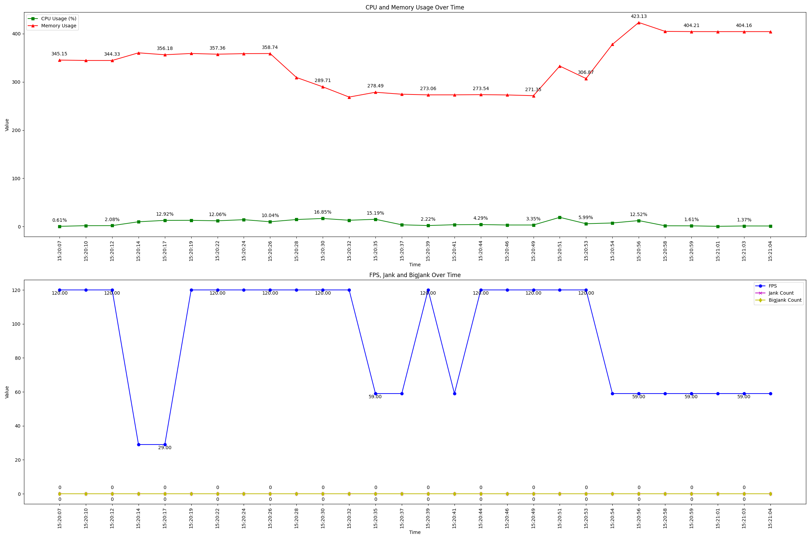

# Perf

android执行命令：

python3 android/androidPerf.py --package_name com.*.* --interval 3 --duration 30
到达duration时间后测试结束

测试报告：

ios执行命令：

iOS17性能测试脚本参考：https://github.com/15525730080/iOS17_perf

执行前先修改dealData文件中cpu_data.append(float(cpu_match.group(1)) / x), x为测试机器的CPU核数

sudo python3 ios/ios17Perf.py --bundle_id tv.danmaku.bilianime --udid 00008101-00185468217A001E
ctrl+c结束测试，结束后等待报告生成

测试报告：

Jank计算方式参考：https://perfdog.qq.com/article_detail?id=10162&issue_id=0&plat_id=1

        PerfDog Jank计算方法：

        1.      同时满足以下两条件，则认为是一次卡顿Jank.

            a)      当前帧耗时>前三帧平均耗时2倍。

            b)      当前帧耗时>两帧电影帧耗时(1000ms/24*2=84ms)。

        2.      同时满足两条件，则认为是一次严重卡顿BigJank.

            a)      当前帧耗时>前三帧平均耗时2倍。

            b)      当前帧耗时>三帧电影帧耗时(1000ms/24*3=125ms)。

        1)      BigJank:1s内严重卡顿次数

        2)      Jank(/10min):平均每10分钟卡顿次数。

        3)      BigJank(/10min):平均每10分钟严重卡顿次数

